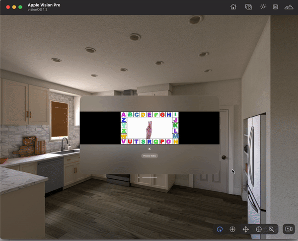

# Sign Language Detection Using Vision and Core ML

The idea behind this project is to demonstrate the potential of Vision OS in understanding sign language in real-time. Imagine if Apple integrated an inbuilt sign language detector within their devices, which could be easily toggled on or off from the settings. Such a feature would enable seamless interaction with people who use sign language, breaking down communication barriers and fostering inclusivity.

This project demonstrates a real-time sign language detection application using Apple's Vision framework and a Core ML model. The application processes a video to detect and classify sign language gestures.

## Features

- Real-time sign language detection
- Video playback with synchronized frame processing
- Core ML model integration for gesture classification

## Requirements

- Xcode 12 or later
- iOS 14 or later
- Swift 5.3 or later

## Installation

1. Clone the repository:

   ```sh
   git clone https://github.com/KaranChander/SignLanguage-VisionOS.git
   cd SignLanguage-VisionOS

2. Open the Xcode Project
    open SignLanguage-VisionOS.xcodeproj

3. Install Git LFS and pull the large model files:
    brew install git-lfs
    git lfs install
    git lfs pull

## Usage

1. Open the app.
2. Tap the "Process Video" button to start video playback and real-time sign language detection.
3. The detected gesture will be displayed on the screen as the video plays.

## Demo



